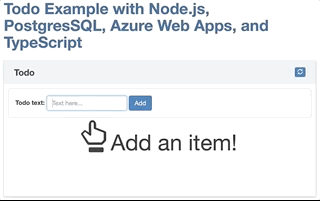

## Sample BDD Tests for Azure-Samples/node-todo web application

Web application source: https://github.com/Azure-Samples/node-todo

Key points of project:
* Python 3.7+
* Behave (https://behave.readthedocs.io/en/latest/)
* Gherkin language (https://en.wikipedia.org/wiki/Cucumber_(software)#Gherkin_language)
* Selenium (https://selenium-python.readthedocs.io)

Run with Docker:
* `docker build -t node-todo-bdd .`
* `docker run --rm --privileged --name node-todo-bdd node-todo-bdd`

Run with Python
* `pip3 install behave selenium requests`
* `behave`

Application work example:

